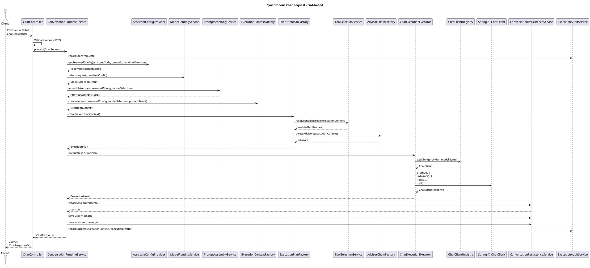
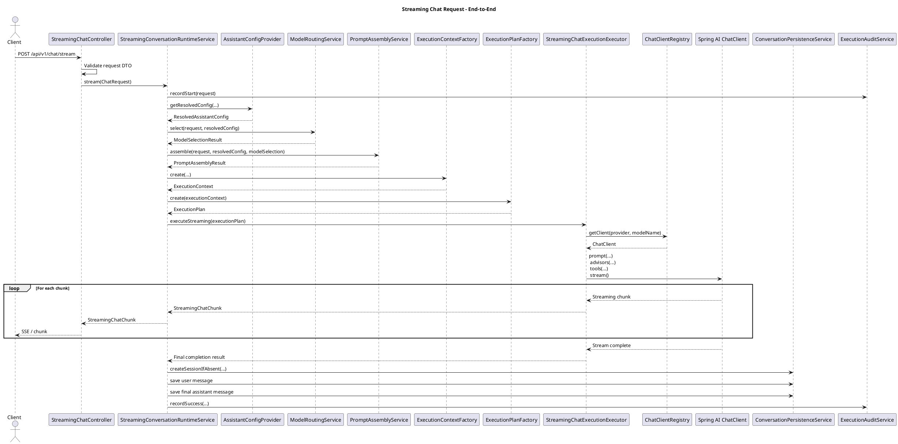
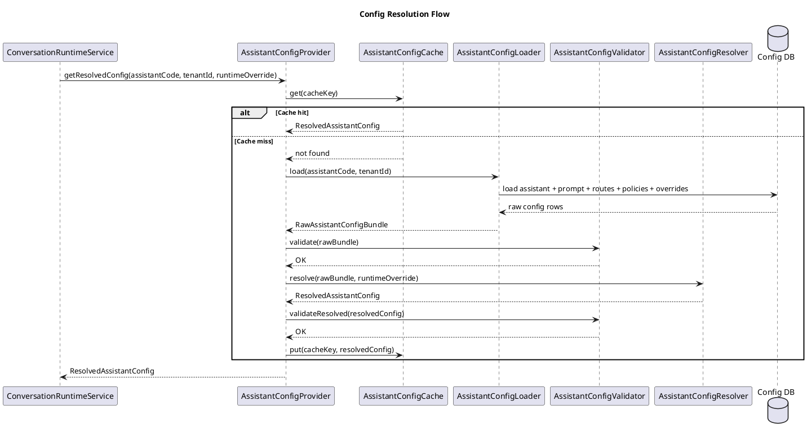
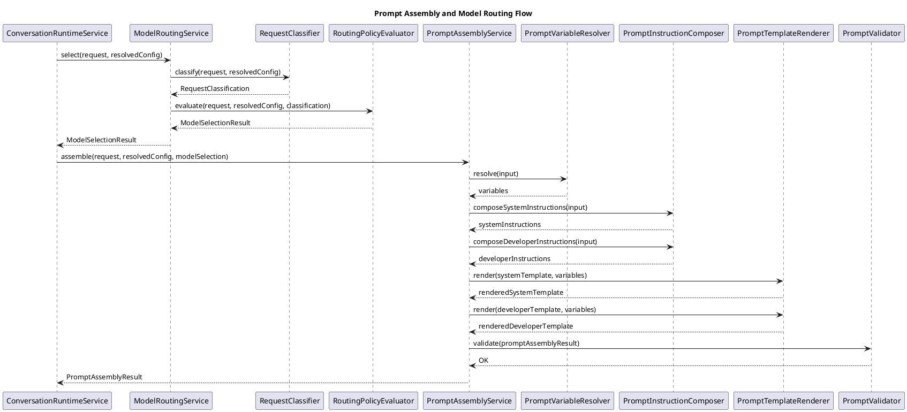
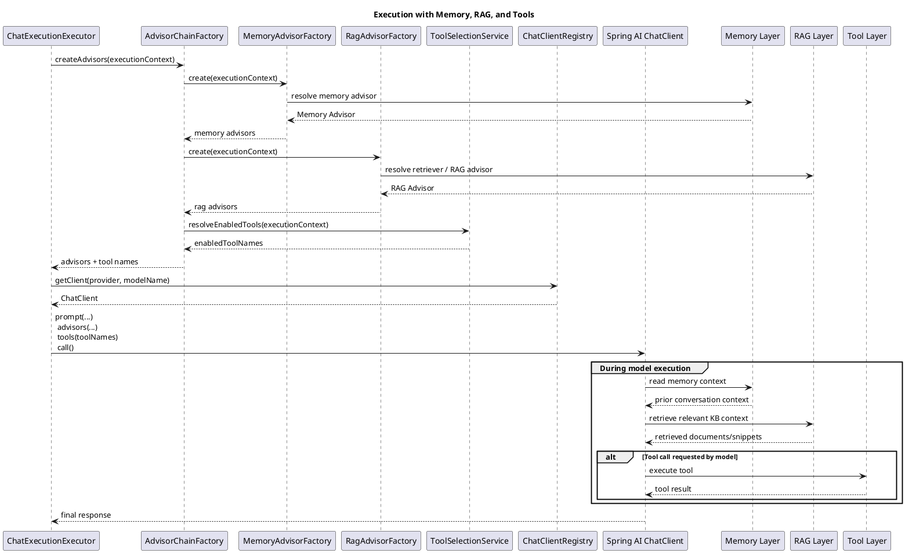
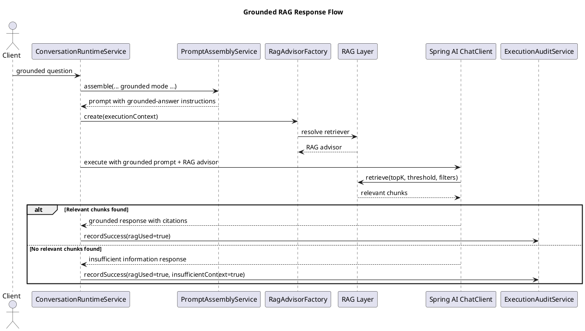
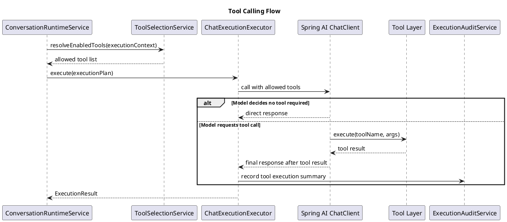
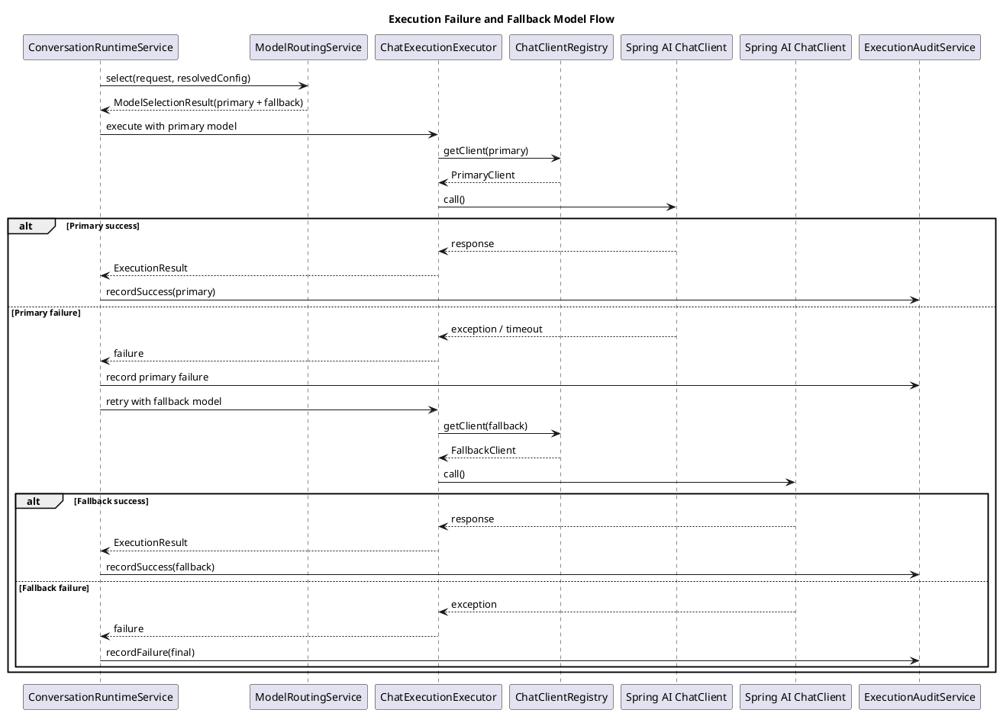
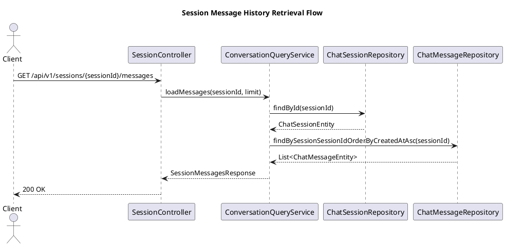
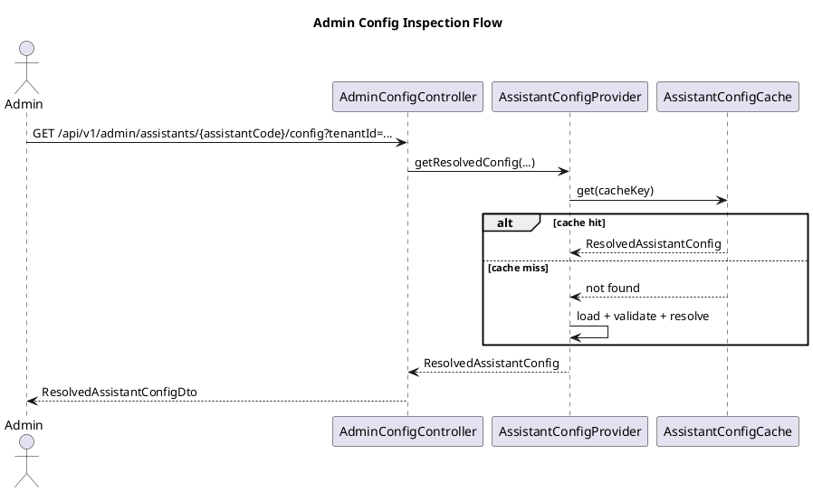

Below are the **PlantUML sequence diagrams** for the major runtime flows.

I’ve kept them aligned with the layers we finalized:

* API layer
* Orchestration layer
* Config layer
* Prompt layer
* Model Routing layer
* Memory layer
* RAG layer
* Tool layer
* Persistence layer

You can paste each block directly into `.puml` files.

---

# 1. Synchronous Chat Request — End-to-End

---

# 2. Streaming Chat Request — End-to-End

---

# 3. Config Resolution Flow

---

# 4. Prompt Assembly + Model Routing Flow

---

# 5. Execution with Memory + RAG + Tools

---

# 6. Grounded RAG Flow

---

# 7. Tool Calling Flow

---

# 8. Execution Failure + Fallback Model Flow

---

# 9. Conversation History Retrieval Flow

---

# 10. Admin Config Inspection Flow

---

## Recommended `.puml` file split

You can keep them as separate files like:

* `01-sync-chat-flow.puml`
* `02-streaming-chat-flow.puml`
* `03-config-resolution-flow.puml`
* `04-prompt-routing-flow.puml`
* `05-execution-memory-rag-tools.puml`
* `06-grounded-rag-flow.puml`
* `07-tool-calling-flow.puml`
* `08-fallback-flow.puml`
* `09-session-history-flow.puml`
* `10-admin-config-flow.puml`

Next, I can convert all finalized LLD sections into **one clean markdown document** with proper headings and these PlantUML blocks embedded.
