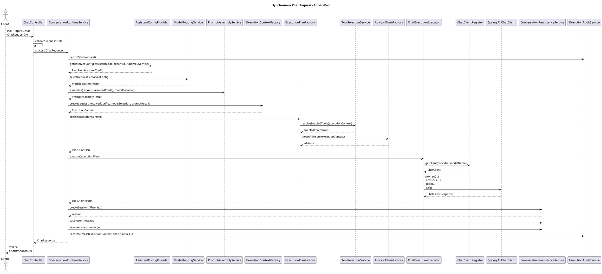
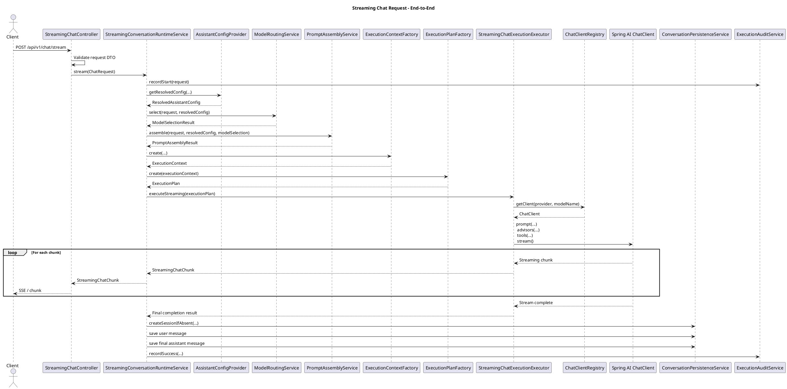
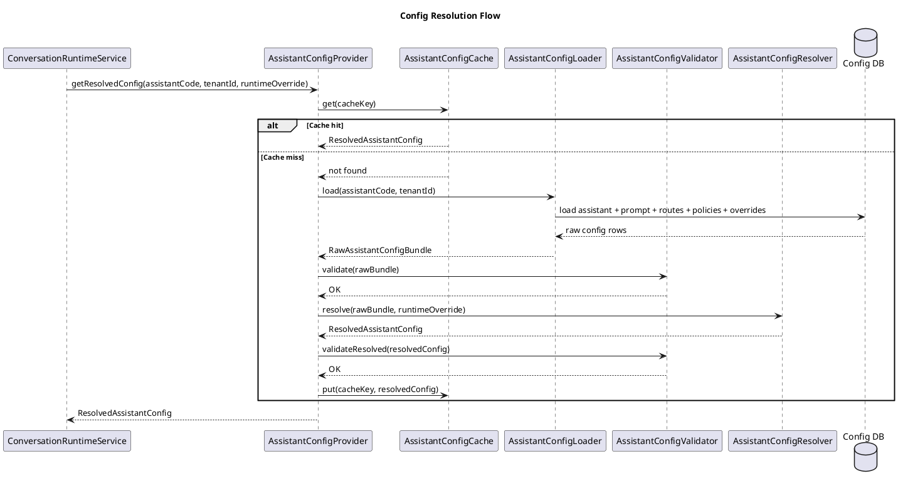
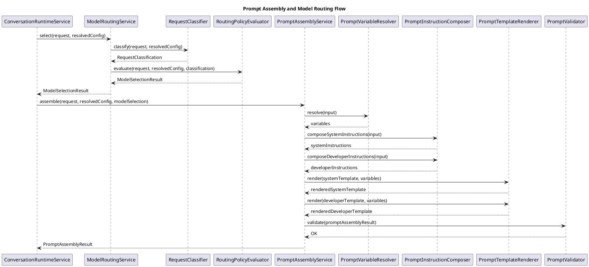
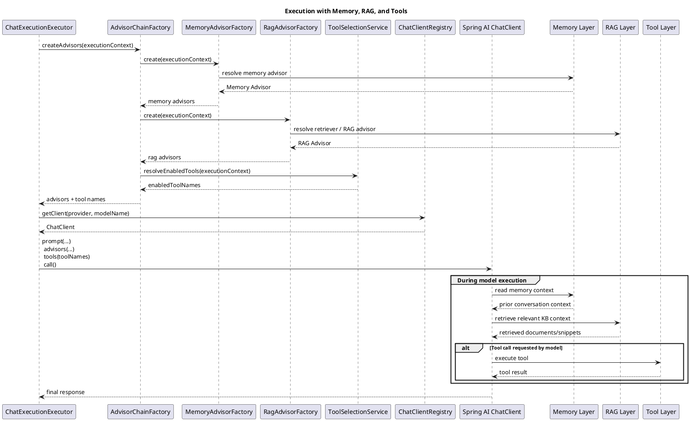
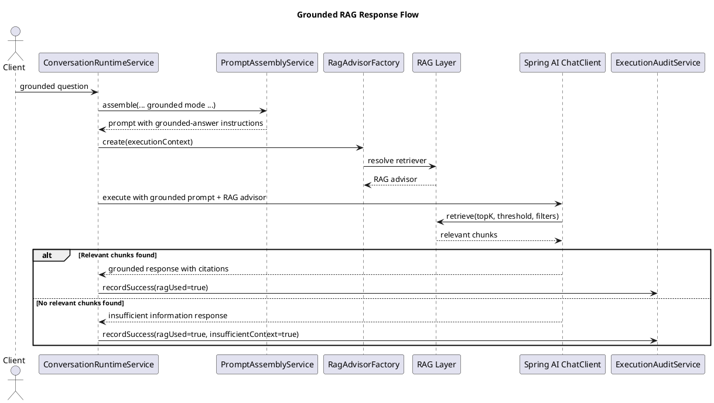
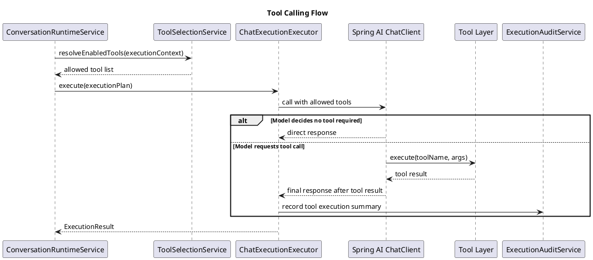
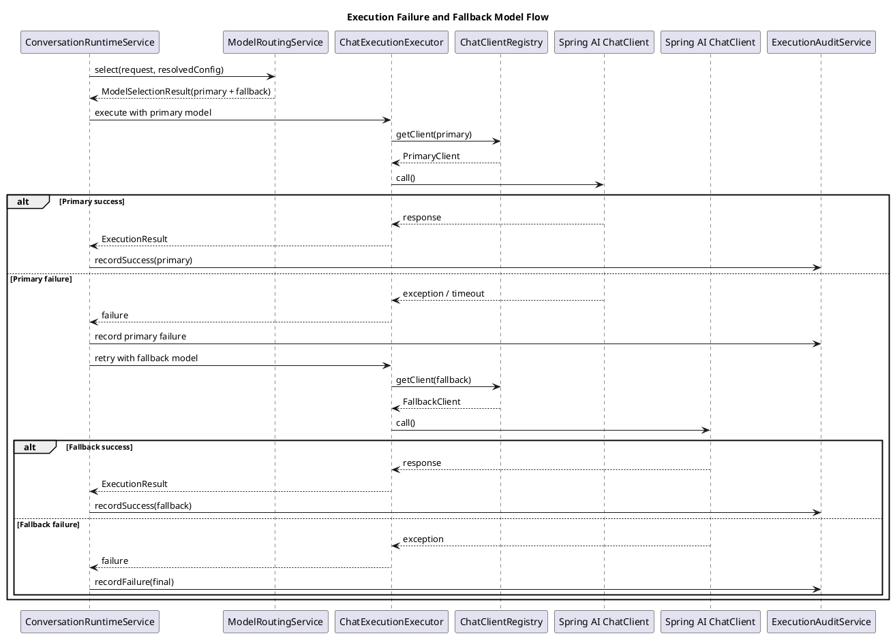
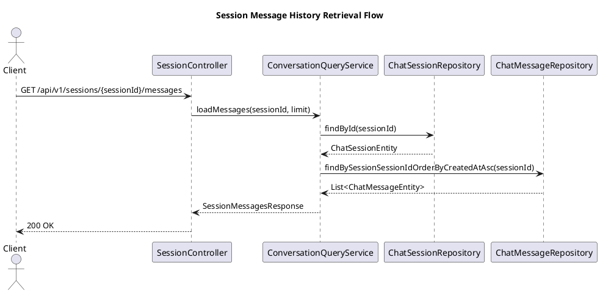
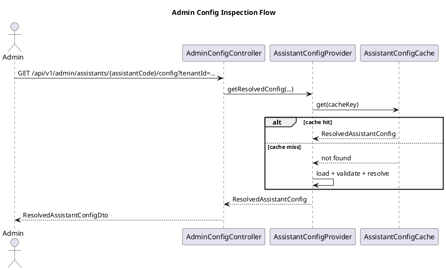

# Generic Chatbot Platform — Low Level Design

## Tech Stack

* Java 21
* Maven 3
* Spring Boot
* Spring AI 2.x
* Spring Data JPA
* Single Maven project
* Package-based layer separation

---

# 1. Overview

This document captures the Low Level Design (LLD) for a **generic chatbot platform** that can be specialized at runtime using:

* assistant-specific configuration
* runtime-selected RAG knowledge base
* configurable tools
* configurable model selection
* configurable memory strategy
* configurable response policy

The design follows a **single Maven project** approach, with each major layer implemented in a **separate package**.

---

# 2. Package Structure

```text
com.yourcompany.ai.chatbot
├── config
├── orchestration
├── prompt
├── modelrouting
├── memory
├── rag
├── tools
├── persistence
├── audit
├── web
├── common
└── support
```

---

# 3. Config Layer — LLD

## 3.1 Purpose

The Config Layer is responsible for loading, validating, caching, resolving, and serving all runtime configuration required by the chatbot platform.

It supports:

* assistant master configuration
* prompt templates
* model routing rules
* memory policy
* RAG policy
* tool policy
* safety / response policy
* tenant-specific overrides
* runtime overrides

It does **not** execute:

* LLM calls
* tool calls
* vector retrieval
* chat memory operations
* orchestration logic

---

## 3.2 Package Structure

```text
com.yourcompany.ai.chatbot.config
├── api
├── model
├── entity
├── repository
├── loader
├── resolver
├── validator
├── cache
├── mapper
├── service
├── exception
└── support
```

---

## 3.3 Design Principles

* return **resolved runtime config**, not raw DB rows
* keep **persistence model** separate from **runtime model**
* validate config before exposing it to runtime
* support tenant-aware config resolution
* return immutable resolved config objects

---

## 3.4 Runtime Config Model

### ResolvedAssistantConfig

```java
public final class ResolvedAssistantConfig {

    private final String assistantCode;
    private final String tenantId;
    private final String assistantName;
    private final boolean active;

    private final ResolvedPromptConfig promptConfig;
    private final ResolvedModelRoutingConfig modelRoutingConfig;
    private final ResolvedRagConfig ragConfig;
    private final ResolvedMemoryConfig memoryConfig;
    private final ResolvedToolConfig toolConfig;
    private final ResolvedSafetyConfig safetyConfig;
    private final ResolvedResponseConfig responseConfig;

    private final String configVersion;
    private final Instant resolvedAt;
}
```

### ResolvedPromptConfig

```java
public final class ResolvedPromptConfig {
    private final String systemPromptTemplate;
    private final String developerPromptTemplate;
    private final Map<String, String> defaultVariables;
    private final List<String> guardrailInstructions;
    private final String promptVersion;
}
```

### ResolvedModelRoutingConfig

```java
public final class ResolvedModelRoutingConfig {
    private final String defaultModel;
    private final List<ResolvedModelRoute> routes;
    private final FallbackPolicy fallbackPolicy;
    private final Integer defaultMaxInputTokens;
    private final Double defaultTemperature;
}
```

### ResolvedRagConfig

```java
public final class ResolvedRagConfig {
    private final boolean enabled;
    private final String defaultKnowledgeBaseId;
    private final Integer topK;
    private final Double similarityThreshold;
    private final String retrievalStrategy;
    private final boolean citationsEnabled;
    private final boolean groundedAnswerRequired;
    private final Map<String, String> metadataFilters;
}
```

### ResolvedMemoryConfig

```java
public final class ResolvedMemoryConfig {
    private final boolean enabled;
    private final MemoryStoreType storeType;
    private final Integer messageWindowSize;
    private final Integer ttlMinutes;
    private final boolean persistChatHistory;
    private final boolean summarizeOldMessages;
}
```

### ResolvedToolConfig

```java
public final class ResolvedToolConfig {
    private final boolean enabled;
    private final List<ResolvedToolDefinition> allowedTools;
    private final boolean allowRuntimeSubsetSelection;
    private final Integer maxToolCallsPerRequest;
    private final Integer toolTimeoutMs;
}
```

### ResolvedSafetyConfig

```java
public final class ResolvedSafetyConfig {
    private final boolean blockUnknownTools;
    private final boolean blockWithoutRagWhenGroundedMode;
    private final boolean allowDirectModelAnswerWithoutContext;
    private final boolean maskSensitiveDataInLogs;
    private final List<String> disallowedTopics;
}
```

### ResolvedResponseConfig

```java
public final class ResolvedResponseConfig {
    private final String defaultTone;
    private final String defaultFormat;
    private final boolean citationRequired;
    private final boolean markdownEnabled;
    private final boolean streamEnabled;
    private final Integer maxOutputTokens;
}
```

---

## 3.5 Public Interfaces

```java
public interface AssistantConfigProvider {
    ResolvedAssistantConfig getResolvedConfig(
        String assistantCode,
        String tenantId,
        RuntimeConfigOverride override
    );

    void evict(String assistantCode, String tenantId);

    void evictAll();
}
```

```java
public interface AssistantConfigLoader {
    RawAssistantConfigBundle load(String assistantCode, String tenantId);
}
```

```java
public interface AssistantConfigValidator {
    void validate(RawAssistantConfigBundle rawBundle);
    void validateResolved(ResolvedAssistantConfig resolvedConfig);
}
```

```java
public interface AssistantConfigResolver {
    ResolvedAssistantConfig resolve(
        RawAssistantConfigBundle rawBundle,
        RuntimeConfigOverride override
    );
}
```

```java
public interface AssistantConfigCache {
    Optional<ResolvedAssistantConfig> get(String key);
    void put(String key, ResolvedAssistantConfig config);
    void evict(String key);
    void evictAll();
}
```

---

## 3.6 Core Classes

### DefaultAssistantConfigProvider

```java
@Service
public class DefaultAssistantConfigProvider implements AssistantConfigProvider {
    private final AssistantConfigLoader loader;
    private final AssistantConfigResolver resolver;
    private final AssistantConfigValidator validator;
    private final AssistantConfigCache cache;
}
```

### DatabaseAssistantConfigLoader

```java
@Component
public class DatabaseAssistantConfigLoader implements AssistantConfigLoader {
    @Override
    public RawAssistantConfigBundle load(String assistantCode, String tenantId) {
        // load all related entities
        // build RawAssistantConfigBundle
    }
}
```

### DefaultAssistantConfigResolver

```java
@Component
public class DefaultAssistantConfigResolver implements AssistantConfigResolver {
    @Override
    public ResolvedAssistantConfig resolve(
            RawAssistantConfigBundle rawBundle,
            RuntimeConfigOverride override) {
        // merge default + assistant + tenant + runtime override
    }
}
```

### CompositeAssistantConfigValidator

```java
@Component
public class CompositeAssistantConfigValidator implements AssistantConfigValidator {
    private final List<RawConfigValidationRule> rawRules;
    private final List<ResolvedConfigValidationRule> resolvedRules;
}
```

### CaffeineAssistantConfigCache

```java
@Component
public class CaffeineAssistantConfigCache implements AssistantConfigCache {
    // internal cache implementation
}
```

---

## 3.7 Merge Order

```text
Platform defaults
   → Assistant defaults
      → Tenant overrides
         → Runtime overrides
```

---

## 3.8 Validation Categories

* structural validation
* referential validation
* semantic validation
* policy validation

---

## 3.9 Exceptions

```java
public class AssistantConfigNotFoundException extends RuntimeException {}
public class AssistantConfigValidationException extends RuntimeException {}
public class AssistantConfigResolutionException extends RuntimeException {}
public class UnauthorizedRuntimeOverrideException extends RuntimeException {}
public class KnowledgeBaseNotFoundException extends RuntimeException {}
```

---

# 4. Orchestration Layer — LLD

## 4.1 Purpose

The Orchestration Layer is the runtime control layer of the chatbot platform.

It:

* receives chat requests
* loads resolved config
* builds execution context
* invokes model routing
* invokes prompt assembly
* assembles execution plan
* invokes Spring AI execution
* coordinates memory, RAG, tools, and audit

It does **not**:

* directly read config tables
* implement tool business logic
* implement vector retrieval
* implement DB persistence

---

## 4.2 Package Structure

```text
com.yourcompany.ai.chatbot.orchestration
├── api
├── model
├── service
├── executor
├── assembler
├── advisor
├── support
├── exception
└── mapper
```

---

## 4.3 Core Runtime Models

### ChatRequest

```java
public class ChatRequest {
    private String assistantCode;
    private String tenantId;
    private String sessionId;
    private String userId;
    private String message;
    private String locale;
    private String channel;
    private Map<String, Object> context;
    private RuntimeConfigOverride runtimeOverride;
}
```

### ChatResponse

```java
public class ChatResponse {
    private String sessionId;
    private String assistantCode;
    private String messageId;
    private String content;
    private List<ResponseCitation> citations;
    private List<ToolExecutionSummary> toolExecutions;
    private String selectedModel;
    private String finishReason;
    private Instant timestamp;
}
```

### ExecutionContext

```java
public class ExecutionContext {
    private String requestId;
    private String tenantId;
    private String sessionId;
    private String userId;
    private String assistantCode;
    private String locale;
    private String channel;

    private ResolvedAssistantConfig resolvedConfig;
    private ModelSelectionResult modelSelection;
    private PromptAssemblyResult promptAssemblyResult;

    private boolean ragEnabled;
    private boolean memoryEnabled;
    private boolean toolCallingEnabled;
    private boolean streamingEnabled;

    private Instant requestStartTime;
}
```

### ExecutionPlan

```java
public class ExecutionPlan {
    private ExecutionContext context;
    private List<Advisor> advisors;
    private List<String> enabledToolNames;
    private String conversationId;
    private boolean requireGroundedAnswer;
    private boolean enableStreaming;
}
```

### ExecutionResult

```java
public class ExecutionResult {
    private String content;
    private List<ResponseCitation> citations;
    private List<ToolExecutionSummary> toolExecutions;
    private String selectedModel;
    private String finishReason;
    private Integer inputTokens;
    private Integer outputTokens;
    private Long latencyMs;
}
```

---

## 4.4 Public Interfaces

```java
public interface ConversationRuntimeService {
    ChatResponse process(ChatRequest request);
}
```

```java
public interface StreamingConversationRuntimeService {
    Flux<StreamingChatChunk> stream(ChatRequest request);
}
```

```java
public interface ChatExecutionExecutor {
    ExecutionResult execute(ExecutionPlan plan);
}
```

```java
public interface StreamingChatExecutionExecutor {
    Flux<StreamingChatChunk> executeStreaming(ExecutionPlan plan);
}
```

---

## 4.5 Main Classes

### DefaultConversationRuntimeService

```java
@Service
public class DefaultConversationRuntimeService implements ConversationRuntimeService {

    private final AssistantConfigProvider assistantConfigProvider;
    private final ExecutionContextFactory executionContextFactory;
    private final ExecutionPlanFactory executionPlanFactory;
    private final ChatExecutionExecutor chatExecutionExecutor;
    private final ExecutionAuditService executionAuditService;
    private final ChatResponseMapper chatResponseMapper;
}
```

### DefaultStreamingConversationRuntimeService

```java
@Service
public class DefaultStreamingConversationRuntimeService
        implements StreamingConversationRuntimeService {

    private final AssistantConfigProvider assistantConfigProvider;
    private final ExecutionContextFactory executionContextFactory;
    private final ExecutionPlanFactory executionPlanFactory;
    private final StreamingChatExecutionExecutor streamingExecutor;
    private final ExecutionAuditService executionAuditService;
}
```

### ExecutionContextFactory

```java
@Component
public class ExecutionContextFactory {
    public ExecutionContext create(
            ChatRequest request,
            ResolvedAssistantConfig resolvedConfig,
            ModelSelectionResult modelSelection,
            PromptAssemblyResult promptAssemblyResult) {
        // build normalized execution context
    }
}
```

### ExecutionPlanFactory

```java
@Component
public class ExecutionPlanFactory {

    private final AdvisorChainFactory advisorChainFactory;
    private final ToolSelectionService toolSelectionService;

    public ExecutionPlan create(ExecutionContext context) {
        // resolve tools
        // build advisors
        // return final plan
    }
}
```

### DefaultChatExecutionExecutor

```java
@Component
public class DefaultChatExecutionExecutor implements ChatExecutionExecutor {

    private final ChatClientRegistry chatClientRegistry;
    private final ChatExecutionResultExtractor resultExtractor;
}
```

---

## 4.6 ChatClient Abstractions

```java
public interface ChatClientRegistry {
    ChatClient getClient(String provider, String modelName);
}
```

or

```java
public interface ChatModelRegistry {
    ChatModel getModel(String provider, String modelName);
}
```

---

## 4.7 Advisor Chain

```java
public interface AdvisorChainFactory {
    List<Advisor> createAdvisors(ExecutionContext context);
}
```

Recommended advisor order:

```text
1. Policy / validation advisor
2. Prompt enrichment advisor
3. Memory advisor
4. RAG advisor
5. Tool-call advisor
6. Audit / trace advisor
7. Response post-processing advisor
```

---

## 4.8 Audit Interface

```java
public interface ExecutionAuditService {
    void recordStart(ExecutionContext context);
    void recordSuccess(ExecutionContext context, ExecutionResult result);
    void recordFailure(ExecutionContext context, Throwable error);
}
```

---

## 4.9 Exceptions

```java
public class ChatExecutionException extends RuntimeException {}
public class ChatExecutionTimeoutException extends RuntimeException {}
public class ChatExecutionPolicyViolationException extends RuntimeException {}
public class UnsupportedStreamingModeException extends RuntimeException {}
public class ModelUnavailableException extends RuntimeException {}
```

---

# 5. Prompt Assembly and Model Routing Layer — LLD

# 5A. Prompt Layer

## 5A.1 Purpose

The Prompt Layer builds the final prompt structure from:

* assistant prompt templates
* runtime request
* response policy
* grounded-answer policy
* tool-usage policy
* runtime variables

It produces a model-ready prompt result.

---

## 5A.2 Package Structure

```text
com.yourcompany.ai.chatbot.prompt
├── api
├── model
├── service
├── resolver
├── template
├── builder
├── validator
├── support
├── mapper
└── exception
```

---

## 5A.3 Core Models

### PromptAssemblyInput

```java
public class PromptAssemblyInput {
    private ChatRequest chatRequest;
    private ResolvedAssistantConfig resolvedConfig;
    private ModelSelectionResult modelSelectionResult;
    private Map<String, Object> resolvedRuntimeVariables;
}
```

### PromptAssemblyResult

```java
public class PromptAssemblyResult {
    private String systemPrompt;
    private String developerPrompt;
    private String userPrompt;
    private Map<String, Object> variables;
    private String promptVersion;
    private PromptRenderMetadata metadata;
}
```

### PromptRenderMetadata

```java
public class PromptRenderMetadata {
    private boolean groundedMode;
    private boolean toolInstructionsInjected;
    private boolean responseFormatInstructionsInjected;
    private boolean memoryInstructionsInjected;
    private boolean ragInstructionsInjected;
}
```

---

## 5A.4 Public Interfaces

```java
public interface PromptAssemblyService {
    PromptAssemblyResult assemble(PromptAssemblyInput input);
}
```

```java
public interface PromptVariableResolver {
    Map<String, Object> resolve(PromptAssemblyInput input);
}
```

```java
public interface PromptTemplateRenderer {
    String render(String template, Map<String, Object> variables);
}
```

```java
public interface PromptInstructionComposer {
    List<String> composeSystemInstructions(PromptAssemblyInput input);
    List<String> composeDeveloperInstructions(PromptAssemblyInput input);
}
```

```java
public interface PromptValidator {
    void validate(PromptAssemblyResult result);
}
```

---

## 5A.5 Main Classes

### DefaultPromptAssemblyService

```java
@Service
public class DefaultPromptAssemblyService implements PromptAssemblyService {

    private final PromptVariableResolver promptVariableResolver;
    private final PromptTemplateRenderer promptTemplateRenderer;
    private final PromptInstructionComposer promptInstructionComposer;
    private final PromptValidator promptValidator;
}
```

### DefaultPromptVariableResolver

```java
@Component
public class DefaultPromptVariableResolver implements PromptVariableResolver {
    @Override
    public Map<String, Object> resolve(PromptAssemblyInput input) {
        Map<String, Object> vars = new HashMap<>();
        return vars;
    }
}
```

### SpringPromptTemplateRenderer

```java
@Component
public class SpringPromptTemplateRenderer implements PromptTemplateRenderer {
    @Override
    public String render(String template, Map<String, Object> variables) {
        PromptTemplate promptTemplate = new PromptTemplate(template);
        return promptTemplate.render(variables);
    }
}
```

### DefaultPromptInstructionComposer

```java
@Component
public class DefaultPromptInstructionComposer implements PromptInstructionComposer {
    @Override
    public List<String> composeSystemInstructions(PromptAssemblyInput input) {
        return new ArrayList<>();
    }

    @Override
    public List<String> composeDeveloperInstructions(PromptAssemblyInput input) {
        return new ArrayList<>();
    }
}
```

---

## 5A.6 Prompt Composition Order

```text
Base System Template
   + Guardrails
   + Safety Instructions
   + Grounded Answer Instructions
   + Response Format Instructions
   = Final System Prompt

Base Developer Template
   + Tool Usage Instructions
   + Citation Instructions
   + Runtime Behavioral Notes
   = Final Developer Prompt
```

---

## 5A.7 Optional Prompt Builders

```java
class SystemPromptBuilder
class DeveloperPromptBuilder
class UserPromptBuilder
class ResponseFormatInstructionBuilder
class ToolInstructionBuilder
class GroundedModeInstructionBuilder
```

---

## 5A.8 Exceptions

```java
public class PromptAssemblyException extends RuntimeException {}
public class PromptTemplateNotFoundException extends RuntimeException {}
public class PromptValidationException extends RuntimeException {}
```

---

# 5B. Model Routing Layer

## 5B.1 Purpose

The Model Routing Layer selects the best provider, model, and execution options based on:

* request characteristics
* assistant routing config
* runtime override hints
* feature requirements such as tools, RAG, streaming, or larger context

---

## 5B.2 Package Structure

```text
com.yourcompany.ai.chatbot.modelrouting
├── api
├── model
├── service
├── classifier
├── evaluator
├── policy
├── support
└── exception
```

---

## 5B.3 Core Models

### RoutingInput

```java
public class RoutingInput {
    private ChatRequest chatRequest;
    private ResolvedAssistantConfig resolvedConfig;
}
```

### RequestClassification

```java
public class RequestClassification {
    private RequestComplexity complexity;
    private boolean ragExpected;
    private boolean toolExpected;
    private boolean structuredOutputExpected;
    private boolean longContextExpected;
    private String classificationReason;
}
```

### ModelSelectionResult

```java
public class ModelSelectionResult {
    private String provider;
    private String modelName;
    private Double temperature;
    private Integer maxInputTokens;
    private Integer maxOutputTokens;
    private boolean streamingEnabled;
    private String routeName;
    private String selectionReason;
    private FallbackSelection fallback;
}
```

### FallbackSelection

```java
public class FallbackSelection {
    private String provider;
    private String modelName;
    private String fallbackReason;
}
```

---

## 5B.4 Public Interfaces

```java
public interface ModelRoutingService {
    ModelSelectionResult select(RoutingInput input);
}
```

```java
public interface RequestClassifier {
    RequestClassification classify(RoutingInput input);
}
```

```java
public interface RoutingPolicyEvaluator {
    ModelSelectionResult evaluate(
        RoutingInput input,
        RequestClassification classification
    );
}
```

```java
public interface ModelSelectionValidator {
    void validate(ModelSelectionResult result, RoutingInput input);
}
```

```java
public interface ChatOptionsFactory {
    ChatOptions create(ModelSelectionResult selectionResult, ResolvedAssistantConfig config);
}
```

---

## 5B.5 Main Classes

### DefaultModelRoutingService

```java
@Service
public class DefaultModelRoutingService implements ModelRoutingService {

    private final RequestClassifier requestClassifier;
    private final RoutingPolicyEvaluator routingPolicyEvaluator;
    private final ModelSelectionValidator modelSelectionValidator;
}
```

### HeuristicRequestClassifier

```java
@Component
public class HeuristicRequestClassifier implements RequestClassifier {
    @Override
    public RequestClassification classify(RoutingInput input) {
        return new RequestClassification();
    }
}
```

### DefaultRoutingPolicyEvaluator

```java
@Component
public class DefaultRoutingPolicyEvaluator implements RoutingPolicyEvaluator {
    @Override
    public ModelSelectionResult evaluate(
            RoutingInput input,
            RequestClassification classification) {
        return new ModelSelectionResult();
    }
}
```

### DefaultChatOptionsFactory

```java
@Component
public class DefaultChatOptionsFactory implements ChatOptionsFactory {
    @Override
    public ChatOptions create(ModelSelectionResult selectionResult,
                              ResolvedAssistantConfig config) {
        return null;
    }
}
```

---

## 5B.6 Routing Strategy

```text
1. get active routes ordered by priority
2. for each route:
      if route matches request classification:
          return selected route
3. else return default model
4. apply fallback policy
```

---

## 5B.7 Exceptions

```java
public class ModelRoutingException extends RuntimeException {}
public class NoEligibleModelException extends RuntimeException {}
public class ModelSelectionValidationException extends RuntimeException {}
```

---

# 6. Persistence / Database Layer — LLD

## 6.1 Purpose

The Persistence Layer is responsible for storing all durable data needed by the chatbot platform:

* assistant config
* policies
* knowledge base registry metadata
* chat sessions
* chat messages
* execution audit
* tool audit
* RAG audit

Implementation uses **Spring Data JPA**.

---

## 6.2 Package Structure

```text
com.yourcompany.ai.chatbot.persistence
├── entity
├── repository
├── projection
├── specification
├── converter
├── support
├── service
├── exception
└── config
```

---

## 6.3 Base Entity

```java
@MappedSuperclass
@EntityListeners(AuditingEntityListener.class)
public abstract class BaseAuditEntity {

    @CreatedDate
    @Column(name = "created_at", nullable = false, updatable = false)
    private Instant createdAt;

    @LastModifiedDate
    @Column(name = "updated_at", nullable = false)
    private Instant updatedAt;

    @Column(name = "created_by", length = 100)
    private String createdBy;

    @Column(name = "updated_by", length = 100)
    private String updatedBy;

    @Version
    @Column(name = "row_version", nullable = false)
    private Long rowVersion;
}
```

---

## 6.4 Configuration Entities

### AssistantEntity

```java
@Entity
@Table(name = "ai_assistant")
public class AssistantEntity extends BaseAuditEntity {
    @Id
    @GeneratedValue(strategy = GenerationType.IDENTITY)
    private Long id;

    private String assistantCode;
    private String name;
    private String description;
    private String tenantScope;
    private String configVersion;
    private Boolean active;
}
```

### PromptTemplateEntity

```java
@Entity
@Table(name = "ai_assistant_prompt")
public class PromptTemplateEntity extends BaseAuditEntity {
    @Id
    @GeneratedValue(strategy = GenerationType.IDENTITY)
    private Long id;

    @ManyToOne(fetch = FetchType.LAZY, optional = false)
    private AssistantEntity assistant;

    private String version;
    private Boolean active;

    @Lob
    private String systemPromptTemplate;

    @Lob
    private String developerPromptTemplate;

    @Convert(converter = JsonMapConverter.class)
    private Map<String, String> promptVariables;

    @Convert(converter = StringListJsonConverter.class)
    private List<String> guardrailInstructions;
}
```

### ModelRouteEntity

```java
@Entity
@Table(name = "ai_assistant_model_route")
public class ModelRouteEntity extends BaseAuditEntity {
    @Id
    @GeneratedValue(strategy = GenerationType.IDENTITY)
    private Long id;

    @ManyToOne(fetch = FetchType.LAZY, optional = false)
    private AssistantEntity assistant;

    private String routeName;
    private RouteType routeType;
    private Integer minPromptLength;
    private Integer maxPromptLength;
    private Boolean ragEnabledOnly;
    private Boolean toolsRequiredOnly;
    private Boolean structuredOutputOnly;
    private String targetProvider;
    private String targetModel;
    private Integer maxInputTokens;
    private Double temperature;
    private Integer priority;
    private Boolean active;
}
```

### MemoryPolicyEntity

```java
@Entity
@Table(name = "ai_assistant_memory_policy")
public class MemoryPolicyEntity extends BaseAuditEntity {
    @Id
    @GeneratedValue(strategy = GenerationType.IDENTITY)
    private Long id;

    @OneToOne(fetch = FetchType.LAZY, optional = false)
    private AssistantEntity assistant;

    private Boolean memoryEnabled;
    private MemoryStoreType storeType;
    private Integer messageWindowSize;
    private Integer ttlMinutes;
    private Boolean persistChatHistory;
    private Boolean summarizeOldMessages;
}
```

### RagPolicyEntity

```java
@Entity
@Table(name = "ai_assistant_rag_policy")
public class RagPolicyEntity extends BaseAuditEntity {
    @Id
    @GeneratedValue(strategy = GenerationType.IDENTITY)
    private Long id;

    @OneToOne(fetch = FetchType.LAZY, optional = false)
    private AssistantEntity assistant;

    private Boolean ragEnabled;
    private String defaultKnowledgeBaseId;
    private Integer topK;
    private Double similarityThreshold;
    private String retrievalStrategy;
    private Boolean citationsEnabled;
    private Boolean groundedAnswerRequired;

    @Convert(converter = JsonMapConverter.class)
    private Map<String, String> metadataFilters;
}
```

### ToolPolicyEntity

```java
@Entity
@Table(name = "ai_assistant_tool_policy")
public class ToolPolicyEntity extends BaseAuditEntity {
    @Id
    @GeneratedValue(strategy = GenerationType.IDENTITY)
    private Long id;

    @ManyToOne(fetch = FetchType.LAZY, optional = false)
    private AssistantEntity assistant;

    private String toolName;
    private ToolType toolType;
    private Boolean enabled;
    private Boolean requiresApproval;
    private Integer timeoutMs;
}
```

### SafetyPolicyEntity

```java
@Entity
@Table(name = "ai_assistant_safety_policy")
public class SafetyPolicyEntity extends BaseAuditEntity {
    @Id
    @GeneratedValue(strategy = GenerationType.IDENTITY)
    private Long id;

    @OneToOne(fetch = FetchType.LAZY, optional = false)
    private AssistantEntity assistant;

    private Boolean blockUnknownTools;
    private Boolean blockWithoutRagWhenGroundedMode;
    private Boolean allowDirectModelAnswerWithoutContext;
    private Boolean maskSensitiveDataInLogs;

    @Convert(converter = StringListJsonConverter.class)
    private List<String> disallowedTopics;
}
```

### ResponsePolicyEntity

```java
@Entity
@Table(name = "ai_assistant_response_policy")
public class ResponsePolicyEntity extends BaseAuditEntity {
    @Id
    @GeneratedValue(strategy = GenerationType.IDENTITY)
    private Long id;

    @OneToOne(fetch = FetchType.LAZY, optional = false)
    private AssistantEntity assistant;

    private String defaultTone;
    private String defaultFormat;
    private Boolean citationRequired;
    private Boolean markdownEnabled;
    private Boolean streamEnabled;
    private Integer maxOutputTokens;
}
```

### KnowledgeBaseEntity

```java
@Entity
@Table(name = "ai_knowledge_base")
public class KnowledgeBaseEntity extends BaseAuditEntity {
    @Id
    @GeneratedValue(strategy = GenerationType.IDENTITY)
    private Long id;

    private String knowledgeBaseId;
    private String name;
    private String vectorStoreType;
    private String embeddingModel;
    private String connectionRef;

    @Convert(converter = JsonMapConverter.class)
    private Map<String, String> metadataFilterPolicy;

    private Boolean active;
}
```

### TenantAssistantOverrideEntity

```java
@Entity
@Table(name = "ai_tenant_assistant_override")
public class TenantAssistantOverrideEntity extends BaseAuditEntity {
    @Id
    @GeneratedValue(strategy = GenerationType.IDENTITY)
    private Long id;

    private String tenantId;

    @ManyToOne(fetch = FetchType.LAZY, optional = false)
    private AssistantEntity assistant;

    private String overrideType;

    @Lob
    private String overridePayloadJson;

    private Boolean active;
}
```

---

## 6.5 Conversation Entities

### ChatSessionEntity

```java
@Entity
@Table(name = "ai_chat_session")
public class ChatSessionEntity extends BaseAuditEntity {
    @Id
    private String sessionId;

    private String tenantId;
    private String assistantCode;
    private String userId;
    private String title;
    private SessionStatus status;
    private Instant lastMessageAt;
    private String locale;
    private String channel;
}
```

### ChatMessageEntity

```java
@Entity
@Table(name = "ai_chat_message")
public class ChatMessageEntity extends BaseAuditEntity {
    @Id
    private String messageId;

    @ManyToOne(fetch = FetchType.LAZY, optional = false)
    private ChatSessionEntity session;

    private String requestId;
    private MessageRole messageRole;

    @Lob
    private String content;

    private String selectedModel;
    private String promptVersion;
    private String configVersion;
    private Integer tokenCount;
    private String finishReason;
    private Boolean hasCitations;
}
```

---

## 6.6 Audit Entities

### ChatExecutionEntity

```java
@Entity
@Table(name = "ai_chat_execution")
public class ChatExecutionEntity {
    @Id
    private String requestId;

    private String sessionId;
    private String tenantId;
    private String assistantCode;
    private String userId;
    private String configVersion;
    private String selectedProvider;
    private String selectedModel;
    private String knowledgeBaseId;
    private MemoryStoreType memoryStoreType;
    private String enabledToolsJson;
    private Boolean streamingEnabled;
    private Boolean success;
    private String errorCode;
    private String errorMessage;
    private Integer inputTokens;
    private Integer outputTokens;
    private Long latencyMs;
    private Instant startedAt;
    private Instant completedAt;
}
```

### ToolExecutionAuditEntity

```java
@Entity
@Table(name = "ai_tool_execution_audit")
public class ToolExecutionAuditEntity extends BaseAuditEntity {
    @Id
    @GeneratedValue(strategy = GenerationType.IDENTITY)
    private Long id;

    private String requestId;
    private String sessionId;
    private String toolName;
    private ToolType toolType;
    private Boolean success;
    private Long latencyMs;
    private String errorCode;
    private String errorMessage;
}
```

### RagRetrievalAuditEntity

```java
@Entity
@Table(name = "ai_rag_retrieval_audit")
public class RagRetrievalAuditEntity extends BaseAuditEntity {
    @Id
    @GeneratedValue(strategy = GenerationType.IDENTITY)
    private Long id;

    private String requestId;
    private String sessionId;
    private String knowledgeBaseId;
    private Integer retrievedDocumentCount;
    private Integer topK;
    private Double similarityThreshold;
    private Long latencyMs;
    private Boolean groundedMode;
}
```

---

## 6.7 Repositories

### Configuration Repositories

```java
public interface AssistantRepository extends JpaRepository<AssistantEntity, Long> {
    Optional<AssistantEntity> findByAssistantCodeAndActiveTrue(String assistantCode);
}
```

```java
public interface PromptTemplateRepository extends JpaRepository<PromptTemplateEntity, Long> {
    Optional<PromptTemplateEntity> findByAssistantIdAndActiveTrue(Long assistantId);
    List<PromptTemplateEntity> findByAssistantIdOrderByCreatedAtDesc(Long assistantId);
}
```

```java
public interface ModelRouteRepository extends JpaRepository<ModelRouteEntity, Long> {
    List<ModelRouteEntity> findByAssistantIdAndActiveTrueOrderByPriorityAsc(Long assistantId);
}
```

```java
public interface MemoryPolicyRepository extends JpaRepository<MemoryPolicyEntity, Long> {
    Optional<MemoryPolicyEntity> findByAssistantId(Long assistantId);
}
```

```java
public interface RagPolicyRepository extends JpaRepository<RagPolicyEntity, Long> {
    Optional<RagPolicyEntity> findByAssistantId(Long assistantId);
}
```

```java
public interface ToolPolicyRepository extends JpaRepository<ToolPolicyEntity, Long> {
    List<ToolPolicyEntity> findByAssistantIdAndEnabledTrue(Long assistantId);
}
```

```java
public interface SafetyPolicyRepository extends JpaRepository<SafetyPolicyEntity, Long> {
    Optional<SafetyPolicyEntity> findByAssistantId(Long assistantId);
}
```

```java
public interface ResponsePolicyRepository extends JpaRepository<ResponsePolicyEntity, Long> {
    Optional<ResponsePolicyEntity> findByAssistantId(Long assistantId);
}
```

```java
public interface KnowledgeBaseRepository extends JpaRepository<KnowledgeBaseEntity, Long> {
    Optional<KnowledgeBaseEntity> findByKnowledgeBaseIdAndActiveTrue(String knowledgeBaseId);
}
```

```java
public interface TenantAssistantOverrideRepository extends JpaRepository<TenantAssistantOverrideEntity, Long> {
    List<TenantAssistantOverrideEntity> findByTenantIdAndAssistantIdAndActiveTrue(String tenantId, Long assistantId);
}
```

### Conversation Repositories

```java
public interface ChatSessionRepository extends JpaRepository<ChatSessionEntity, String> {
    List<ChatSessionEntity> findByTenantIdAndUserIdOrderByLastMessageAtDesc(String tenantId, String userId);
}
```

```java
public interface ChatMessageRepository extends JpaRepository<ChatMessageEntity, String> {
    List<ChatMessageEntity> findBySessionSessionIdOrderByCreatedAtAsc(String sessionId);
}
```

### Audit Repositories

```java
public interface ChatExecutionRepository extends JpaRepository<ChatExecutionEntity, String> {
    List<ChatExecutionEntity> findBySessionIdOrderByStartedAtDesc(String sessionId);
}
```

```java
public interface ToolExecutionAuditRepository extends JpaRepository<ToolExecutionAuditEntity, Long> {
    List<ToolExecutionAuditEntity> findByRequestId(String requestId);
}
```

```java
public interface RagRetrievalAuditRepository extends JpaRepository<RagRetrievalAuditEntity, Long> {
    List<RagRetrievalAuditEntity> findByRequestId(String requestId);
}
```

---

## 6.8 Persistence Services

```java
public interface ConversationPersistenceService {
    ChatSessionEntity createSessionIfAbsent(String sessionId, String tenantId, String assistantCode, String userId, String locale, String channel);
    ChatMessageEntity saveMessage(ChatMessageEntity message);
    List<ChatMessageEntity> loadConversation(String sessionId);
}
```

```java
public interface ExecutionAuditPersistenceService {
    void saveExecutionStart(ChatExecutionEntity execution);
    void saveExecutionCompletion(ChatExecutionEntity execution);
    void saveToolAudits(List<ToolExecutionAuditEntity> audits);
    void saveRagAudit(RagRetrievalAuditEntity audit);
}
```

---

## 6.9 Converters

```java
@Converter
public class JsonMapConverter implements AttributeConverter<Map<String, String>, String> {
    // Jackson-based implementation
}
```

```java
@Converter
public class StringListJsonConverter implements AttributeConverter<List<String>, String> {
    // Jackson-based implementation
}
```

---

## 6.10 Enums

```java
public enum RouteType {
    SIMPLE, KNOWLEDGE_QA, TOOL_HEAVY, LONG_CONTEXT, STRUCTURED_OUTPUT
}

public enum MemoryStoreType {
    NONE, IN_MEMORY, JDBC
}

public enum ToolType {
    LOCAL_BEAN, REST, MCP
}

public enum SessionStatus {
    ACTIVE, CLOSED, EXPIRED
}

public enum MessageRole {
    SYSTEM, USER, ASSISTANT, TOOL
}
```

---

# 7. API Request / Response Schemas — LLD

## 7.1 Purpose

The API Schema Layer defines the external REST and streaming contracts of the chatbot platform.

It standardizes:

* request DTOs
* response DTOs
* streaming chunk DTOs
* error responses
* session retrieval APIs
* validation rules

---

## 7.2 Package Structure

```text
com.yourcompany.ai.chatbot.web
├── controller
├── dto
│   ├── request
│   ├── response
│   ├── common
│   ├── streaming
│   └── admin
├── mapper
├── advice
├── validator
└── support
```

---

## 7.3 Endpoints

```text
POST /api/v1/chat
POST /api/v1/chat/stream
GET /api/v1/sessions/{sessionId}
GET /api/v1/sessions/{sessionId}/messages
GET /api/v1/users/{userId}/sessions
GET /api/v1/admin/assistants/{assistantCode}/config
GET /api/v1/admin/executions/{requestId}
```

---

## 7.4 Request DTOs

### ChatRequestDto

```java
public class ChatRequestDto {

    @NotBlank
    @Size(max = 100)
    private String assistantCode;

    @NotBlank
    @Size(max = 100)
    private String tenantId;

    @NotBlank
    @Size(max = 100)
    private String sessionId;

    @NotBlank
    @Size(max = 100)
    private String userId;

    @NotBlank
    @Size(max = 20000)
    private String message;

    @Size(max = 20)
    private String locale;

    @Size(max = 50)
    private String channel;

    private Map<String, Object> context;

    @Valid
    private RuntimeOverrideDto runtimeOverride;
}
```

### RuntimeOverrideDto

```java
public class RuntimeOverrideDto {

    @Size(max = 100)
    private String knowledgeBaseId;

    private MemoryStoreType memoryStoreType;

    @Size(max = 20)
    private List<@NotBlank @Size(max = 100) String> enabledToolNames;

    @Size(max = 100)
    private String modelHint;

    private Boolean streamingEnabled;
}
```

### SessionCreateRequestDto

```java
public class SessionCreateRequestDto {

    @NotBlank
    @Size(max = 100)
    private String tenantId;

    @NotBlank
    @Size(max = 100)
    private String assistantCode;

    @NotBlank
    @Size(max = 100)
    private String userId;

    @Size(max = 20)
    private String locale;

    @Size(max = 50)
    private String channel;
}
```

### HistoryQueryRequestDto

```java
public class HistoryQueryRequestDto {
    @Min(1)
    @Max(500)
    private Integer limit = 50;

    private String cursor;
}
```

---

## 7.5 Response DTOs

### ChatResponseDto

```java
public class ChatResponseDto {

    private String requestId;
    private String sessionId;
    private String messageId;
    private String assistantCode;
    private String content;
    private String selectedProvider;
    private String selectedModel;
    private String finishReason;
    private Instant timestamp;
    private ResponseUsageDto usage;
    private List<ResponseCitationDto> citations;
    private List<ToolExecutionSummaryDto> toolExecutions;
    private ResponseMetadataDto metadata;
}
```

### ResponseUsageDto

```java
public class ResponseUsageDto {
    private Integer inputTokens;
    private Integer outputTokens;
    private Long latencyMs;
}
```

### ResponseCitationDto

```java
public class ResponseCitationDto {
    private String sourceId;
    private String sourceType;
    private String title;
    private String snippet;
    private String location;
}
```

### ToolExecutionSummaryDto

```java
public class ToolExecutionSummaryDto {
    private String toolName;
    private String toolType;
    private Boolean success;
    private Long latencyMs;
}
```

### ResponseMetadataDto

```java
public class ResponseMetadataDto {
    private Boolean ragUsed;
    private Boolean memoryUsed;
    private Boolean toolsUsed;
    private String knowledgeBaseId;
    private String promptVersion;
    private String configVersion;
    private Boolean streamed;
}
```

### SessionSummaryDto

```java
public class SessionSummaryDto {
    private String sessionId;
    private String tenantId;
    private String assistantCode;
    private String userId;
    private String title;
    private String status;
    private Instant createdAt;
    private Instant updatedAt;
    private Instant lastMessageAt;
    private String locale;
    private String channel;
}
```

### MessageDto

```java
public class MessageDto {
    private String messageId;
    private String requestId;
    private String role;
    private String content;
    private String selectedModel;
    private String finishReason;
    private Boolean hasCitations;
    private Instant timestamp;
}
```

### SessionMessagesResponseDto

```java
public class SessionMessagesResponseDto {
    private String sessionId;
    private List<MessageDto> messages;
    private PageMetadataDto page;
}
```

### UserSessionsResponseDto

```java
public class UserSessionsResponseDto {
    private String userId;
    private List<SessionSummaryDto> sessions;
    private PageMetadataDto page;
}
```

### PageMetadataDto

```java
public class PageMetadataDto {
    private Integer size;
    private Integer count;
    private String nextCursor;
}
```

---

## 7.6 Streaming DTOs

### StreamingChatChunkDto

```java
public class StreamingChatChunkDto {
    private String requestId;
    private String sessionId;
    private String eventType;
    private String contentChunk;
    private Integer sequenceNumber;
    private Instant timestamp;
    private StreamingMetadataDto metadata;
}
```

### StreamingMetadataDto

```java
public class StreamingMetadataDto {
    private String selectedModel;
    private String selectedProvider;
    private Boolean partial;
    private String finishReason;
}
```

### StreamingCompletionDto

```java
public class StreamingCompletionDto {
    private String requestId;
    private String sessionId;
    private String messageId;
    private String eventType;
    private ResponseUsageDto usage;
    private List<ResponseCitationDto> citations;
    private List<ToolExecutionSummaryDto> toolExecutions;
    private Instant timestamp;
}
```

---

## 7.7 Error Schema

### ApiErrorResponseDto

```java
public class ApiErrorResponseDto {
    private String errorCode;
    private String errorMessage;
    private String requestId;
    private Instant timestamp;
    private List<FieldValidationErrorDto> fieldErrors;
}
```

### FieldValidationErrorDto

```java
public class FieldValidationErrorDto {
    private String field;
    private String message;
}
```

### Recommended Error Codes

```text
INVALID_REQUEST
VALIDATION_ERROR
ASSISTANT_NOT_FOUND
CONFIG_NOT_FOUND
CONFIG_INVALID
MODEL_UNAVAILABLE
RAG_REQUIRED_BUT_UNAVAILABLE
TOOL_NOT_ALLOWED
TOOL_EXECUTION_FAILED
SESSION_NOT_FOUND
INTERNAL_ERROR
STREAMING_NOT_SUPPORTED
```

---

## 7.8 Controllers

### ChatController

```java
@RestController
@RequestMapping("/api/v1/chat")
public class ChatController {

    private final ConversationRuntimeService conversationRuntimeService;
    private final ChatApiMapper chatApiMapper;
}
```

### StreamingChatController

```java
@RestController
@RequestMapping("/api/v1/chat")
public class StreamingChatController {

    private final StreamingConversationRuntimeService streamingRuntimeService;
    private final StreamingApiMapper streamingApiMapper;
}
```

### SessionController

```java
@RestController
@RequestMapping("/api/v1/sessions")
public class SessionController {

    @GetMapping("/{sessionId}")
    public ResponseEntity<SessionSummaryDto> getSession(@PathVariable String sessionId) { }

    @GetMapping("/{sessionId}/messages")
    public ResponseEntity<SessionMessagesResponseDto> getMessages(
            @PathVariable String sessionId,
            @RequestParam(defaultValue = "50") Integer limit) { }
}
```

---

## 7.9 Exception Advice

```java
@RestControllerAdvice
public class GlobalApiExceptionHandler {

    @ExceptionHandler(MethodArgumentNotValidException.class)
    public ResponseEntity<ApiErrorResponseDto> handleValidation(MethodArgumentNotValidException ex) { }

    @ExceptionHandler(AssistantConfigNotFoundException.class)
    public ResponseEntity<ApiErrorResponseDto> handleConfigNotFound(AssistantConfigNotFoundException ex) { }

    @ExceptionHandler(ChatExecutionException.class)
    public ResponseEntity<ApiErrorResponseDto> handleChatExecution(ChatExecutionException ex) { }

    @ExceptionHandler(Exception.class)
    public ResponseEntity<ApiErrorResponseDto> handleGeneric(Exception ex) { }
}
```

---

# 8. Sequence Diagrams — PlantUML

## 8.1 Synchronous Chat Request — End-to-End



---

## 8.2 Streaming Chat Request — End-to-End



---

## 8.3 Config Resolution Flow



---

## 8.4 Prompt Assembly and Model Routing Flow



---

## 8.5 Execution with Memory, RAG, and Tools



---

## 8.6 Grounded RAG Response Flow



---

## 8.7 Tool Calling Flow



---

## 8.8 Execution Failure and Fallback Model Flow



---

## 8.9 Session Message History Retrieval Flow



---

## 8.10 Admin Config Inspection Flow



---

# 9. Recommended Implementation Order

1. Persistence base entities and repositories
2. Config loader, resolver, validator, cache
3. Model routing layer
4. Prompt assembly layer
5. Orchestration layer
6. API DTOs and controllers
7. Memory / RAG / Tool integration factories
8. Audit persistence and reporting
9. Sequence diagram validation against final code design

---

# 10. Final Design Recommendations

* use one **single Maven project**
* keep each major layer in a **separate package**
* keep **config models**, **runtime models**, **API DTOs**, and **JPA entities** separate
* keep **message history** separate from **chat memory**
* keep **vector retrieval implementation** outside JPA persistence
* keep **prompt assembly** and **model routing** as dedicated runtime layers
* keep orchestration thin but strict
* use policy-driven model selection and runtime override validation
* persist sufficient audit to reproduce decisions and troubleshoot runtime behavior
